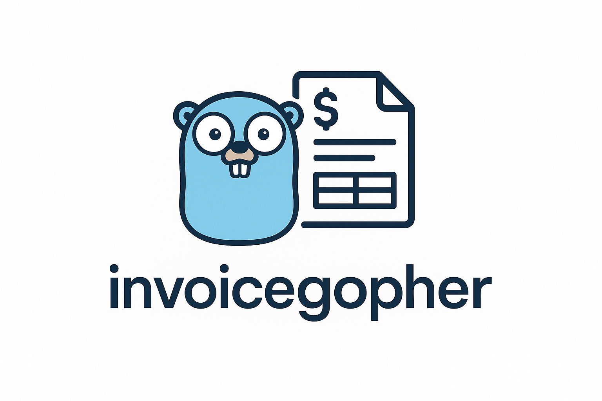

# 🧾 Invoice Gopher – Generate Stunning HTML Invoices in Go




**Invoice Gopher** is a lightweight Go package that makes creating **professional, mobile-friendly, and print-ready HTML invoices** a breeze.  
Perfect for freelancers, small businesses, and SaaS apps that need clean, customizable invoices without wrestling with CSS.

---

## ✨ Features

- 🚀 **Generate HTML invoices** directly from Go structs  
- 🎨 **Modern & responsive design** powered by Tailwind CSS  
- 🖨 **Print-ready** with optimized styles for PDF export  
- 🖼 Supports **company logos & branding**  
- 📦 **Automatic total calculation** for invoice items  
- 🧩 **Fully customizable HTML template**  
- 📱 Works flawlessly on **desktop & mobile**  

---

## 📦 Installation

```bash
go get github.com/shubhvish4495/invoicegopher
```

## 💡 Quick Start

### Example 1 – Generate a Sample Invoice

```go
package main

import (
    "log"
    invoiceGen "github.com/shubhvish4495/invoicegopher"
)

func main() {
    invoice := invoiceGen.GenerateDummyInvoice()
    err := invoiceGen.GenerateInvoice(invoice, "output")
    if err != nil {
        log.Fatalf("Error generating invoice: %v", err)
    }
}
```

---

### Example 2 – Create a Custom Invoice

```go
package main

import (
    "time"
    "log"
    invoiceGen "github.com/shubhvish4495/invoicegopher"
)

func main() {
    invoice := invoiceGen.Invoice{
        InvoiceNo: "INV-001",
        Date:      time.Now().Format("02 January, 2006"),
        From: invoiceGen.Contact{
            Name:    "Your Company",
            Address: "123 Business St., Business City",
            Email:   "contact@yourcompany.com",
            LogoURL: "https://your-logo-url.com/logo.png",
        },
        BilledTo: invoiceGen.Contact{
            Name:    "Client Name",
            Address: "456 Client Ave., Client City",
            Email:   "client@example.com",
        },
        Items: []invoiceGen.InvoiceItem{
            {Description: "Web Development", Quantity: 1, Price: 1500},
            {Description: "Consulting Hours", Quantity: 10, Price: 100},
        },
        PaymentMethod: "Bank Transfer",
        Note:          "Thank you for your business!",
    }

    for i := range invoice.Items {
        invoice.Items[i].Amount = float64(invoice.Items[i].Quantity) * invoice.Items[i].Price
    }
    invoice.CalculateTotal()

    if err := invoiceGen.GenerateInvoice(invoice, "output"); err != nil {
        log.Fatalf("Error: %v", err)
    }
}
```

---

## 📂 Data Structures

```go
type Invoice struct {
    InvoiceNo     string
    Date          string
    From          Contact
    BilledTo      Contact
    Items         []InvoiceItem
    Total         float64
    PaymentMethod string
    Note          string
}

type Contact struct {
    Name    string
    Address string
    Email   string
    LogoURL string
}

type InvoiceItem struct {
    Description string
    Quantity    int
    Price       float64
    Amount      float64
}
```

---

## 🎨 Template Customization

- **HTML Template:** `invoice_template.html`
- **Styling:** Tailwind CSS (CDN) + Google Fonts
- **Fully Responsive** – looks great on phones, tablets, and desktops
- **Print-Optimized** – export directly to PDF from any browser

To customize the design:

```bash
nano invoice_template.html
```

Update the HTML, CSS classes, or branding as you like.

---

## 📤 Output

- Saved as an HTML file
- Can be:
  - Opened in any browser
  - Printed as PDF
  - Emailed directly to clients

Example output: `output/invoice.html`

---

## 📁 Project Structure

```
.
├── go.mod
├── invoicegopher.go      # Core invoice generation logic
├── invoicegopher_test.go # Core invoice generation logic tests
├── model.go              # Data structures
├── invoice_template.html # HTML template
├── sample/
│   └── main.go           # Example usage
└── output                # folder to store sample output html
```

---

## ⚙️ Requirements

- Go 1.24.4+
- Internet connection (for Tailwind CSS & fonts)

---

## 📜 License

MIT License – feel free to use and modify.